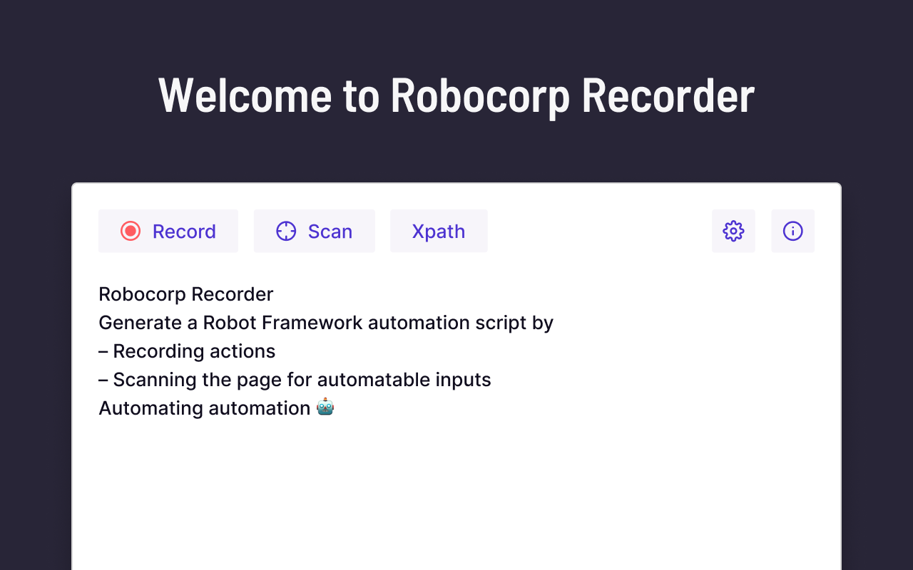
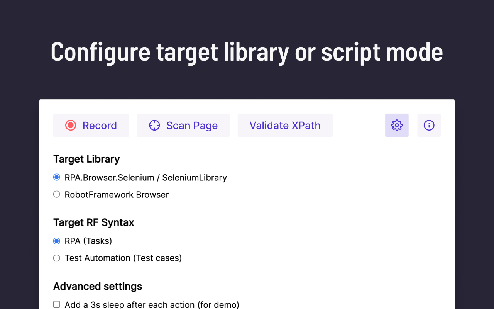
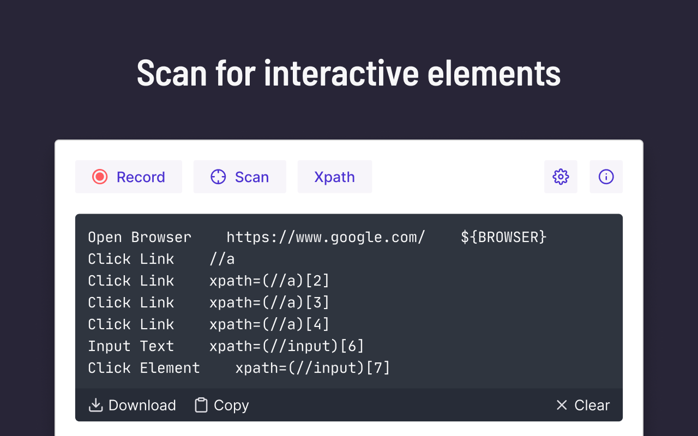

# RobotFramework Recorder


> A browser extension that generates [RobotFramework](http://robotframework.org/) automation scripts for SeleniumLibrary and Browser. 

Fork based on https://github.com/sohwendy/Robotcorder

## How-to

### Using the extension itself


### Understanding and extending the generated "script templates"

For understanding and extending the generated scripts, see upstream
- [robotframework-browser](https://robotframework-browser.org/) documentation
- [SeleniumLibrary](https://robotframework.org/SeleniumLibrary/) documentation

For understanding the XPATH selectors see [Xpath Cheatsheet](https://devhints.io/xpath)

For extra guides you can check out https://robotframework-recorder.com/docs/development-howtos/browser for generic browser automation documentation and 
https://robotframework-recorder.com/docs/development-howtos/browser/playwright for playwright based Browser library documentation.

## Screenshots
### Main view



### Settings



### Scan output



## Features

1. Recording user actions
2. Scanning the html page
3. Validating XPATH selectors

### New Features RF Recorder (December 2020)
Choose between generating locators for Robotframework Browser (playwright based) or SeleniumLibrary
Choose between RPA or Test focused Robot Framework syntax

### New Features (Robotcorder, 22 Sept 2018)
Edit the locators.
go to chrome://extensions  
click on Extension options  
edit and update the locators

## Download
Coming to chrome web store soon. For now see https://github.com/robotframework-recorder/Robotcorder/releases for manual installation of latest release.
<!--  [Robotcorder - Chrome Web Store](https://chrome.google.com/webstore/detail/robotcorder/ifiilbfgcemdapeibjfohnfpfmfblmpd) 
-->

## Package
``` $ script/export.command ```
or
``` $ npm run export ```

## Contributing
1. Fork it
2. Create your feature branch (git checkout -b my-new-feature)
3. Commit your changes (git commit -am 'Add some feature')
4. Push to the branch (git push origin my-new-feature)
5. Create new Pull Request

## Change Log
Refer to [CHANGELOG.md](https://github.com/robotframework-recorder/Robotcorder/blob/master/CHANGELOG.md)

<!--
## Github Pages
Found in /docs.
Refer to [Robotcorder-Page](https://sohwendy.github.io/Robotcorder-Page/) for instruction how to update github page.


[](https://forthebadge.com)
[](https://forthebadge.com)


[](https://forthebadge.com)
[](https://forthebadge.com)
[](https://forthebadge.com)

-->


